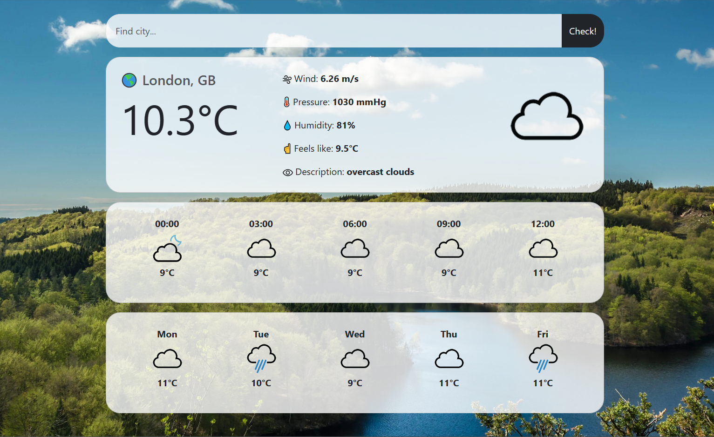

# Django Weather App 🌎 


Weather forecast - ***current, next 12 hours, 5 days.***

## Usage
🔎 Enter the desired city in the search and see the result.

## Features 
* 💨 Wind speed
* 🌡️ Pressure 
* 💧 Humidity
* ☝ Feels like
* 📃 Description


## Setup

The first thing to do is to clone the repository:
```bash
git clone https://github.com/iamwebster/weather-app.git
cd weather-app
```

Create a virtual environment to install dependencies in and activate it:<br>
*Windows:*
```bash
python -m venv venv
venv\scripts\activate
(venv) pip install -r requirements.txt
```

*macOS or Linux:*
```bash
$ pip install virtualenv
$ virtualenv venv
$ virtualenv -p /usr/bin/python3 venv
$ source venv/bin/activate
```

Then install the dependencies:
```bash
(venv) pip install -r requirements.txt
```

Now you can launch the application:
```bash
cd weather
```

Then you should get the api-key from the [openweathermap](https://openweathermap.org/) website.
Create a *.env* file and enter key:
```python
API_KEY = "***api-key***"
```

Finally you can run the application:
```bash
python manage.py runserver
```

